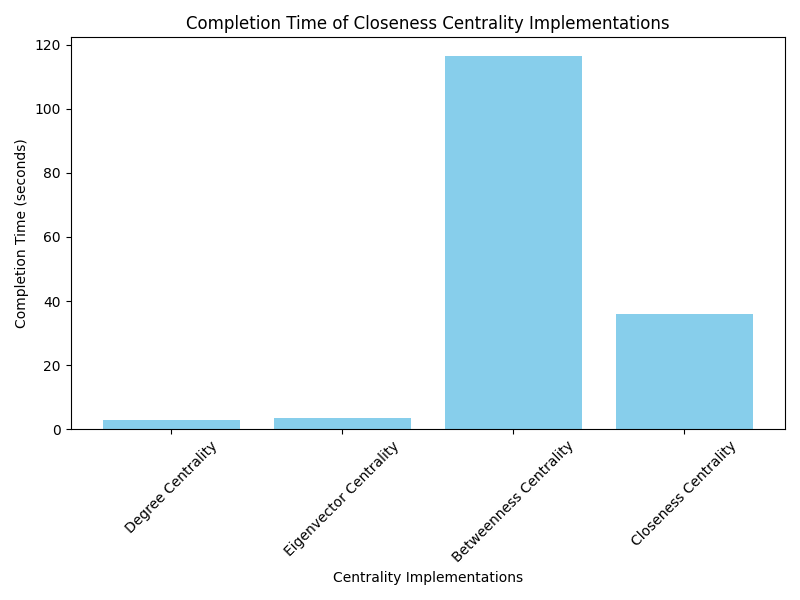

# Centrality Comparison

| Implementation       | Completion Time (seconds) |
|----------------------|---------------------------|
| Degree Centrality     | 2.9                       |
| Eigenvector Centrality     | 3.4                       |
| Betweenness Centrality     | 116.5                     |
| Closeness Centrality     | 35.8                      |

